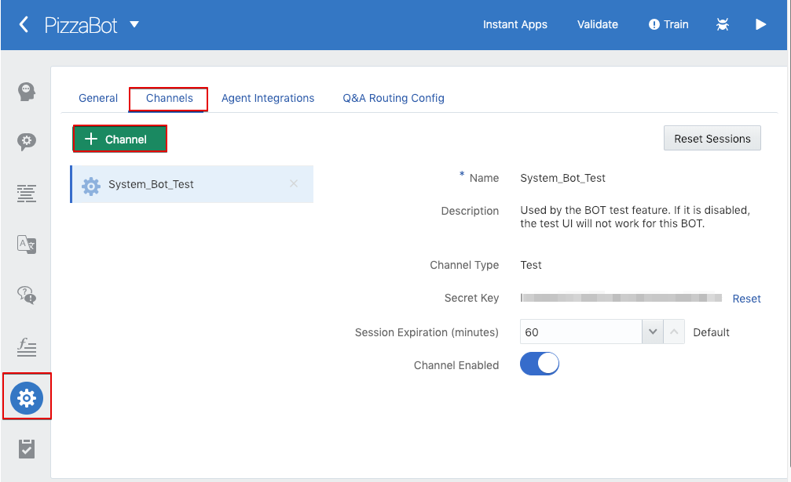
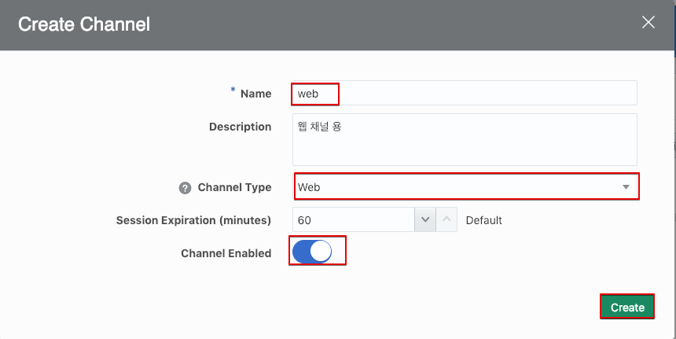
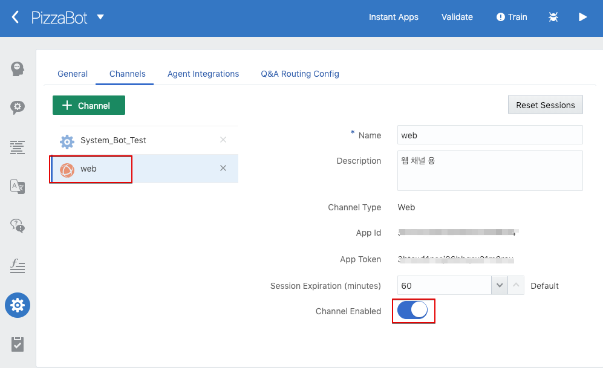
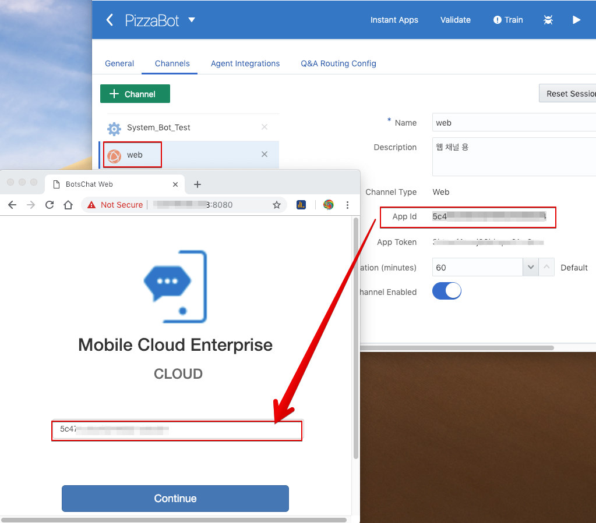
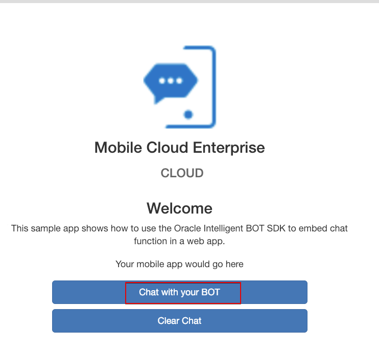
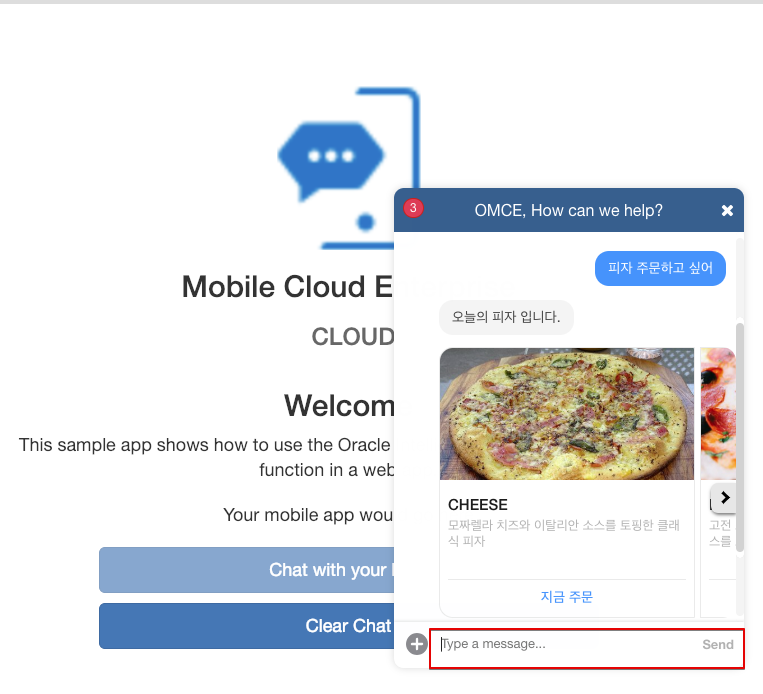

Lab300 - [채널 연결] Web Chat 연결하기
=======

이 Lab에서는 지금까지 만든 피자봇을 웹 채팅 창을 통해서 연결해 보는 실습을 할 것입니다.

## 웹 채널 생성
이전 Lab에서 생성한 각자의 피자봇 **PizzaBot_{SEQ}** (예 : PizzaBot_01)를 선택하고 들어갑니다.

좌측의 **톱니바퀴** 모양의 설정 아이콘을 클릭하여 설정 페이지로 들어가서 **Channels** 탭을 선택합니다. 

**System_Bot_Test**라는 Test UI에서 사용하는 채널이 기본적으로 등록되어 있습니다. 이 설정은 그대로 두고 **+ Channel** 버튼을 클릭하여 새로운 채널을 생성하도록 합니다. 

다음과 같이 입력하고 **Create** 버튼을 클릭합니다.

* Name : web
* Descrption : 웹 채널 용 
* Channel Type : Web
* Channel Enabled : Enabled

다음과 같이 채널이 만들어 진 것을 확인 합니다.

채널 생성은 완료되었습니다.

## 웹 페이지에서 테스트 하기
Oracle Digital Assistant는 웹채널을 태스트 하기 위한 chat-sample-web 코드를 제공하고 있습니다.

이 코드가 구동되고 있는 환경 정보가 제공되었을 것입니다. 브라우저를 통해 제공된 URL에 접속합니다. 아래 화면의 왼쪽 브라우저와 같은 페이지가 보여질 것입니다.
Text Box에 자신의 PizzaBot에서 만든 **Web** 채널의 **App Id**를 복사해서 입력해 줍니다. **Continue**를 누르면 해당 웹페이지의 채팅은 자신의 PizzaBot에 연결 될 것입니다.

**Chat with your BOT** 버튼을 클릭하여 대화를 시작해 봅니다.

다음과 같이 채팅창이 열리게 됩니다. **Type a message** 텍스트 박스에 대화를 입력합니다.
피자봇에서 구현했던 4개의 Intent들을 차례로 테스트 해보면 됩니다.

