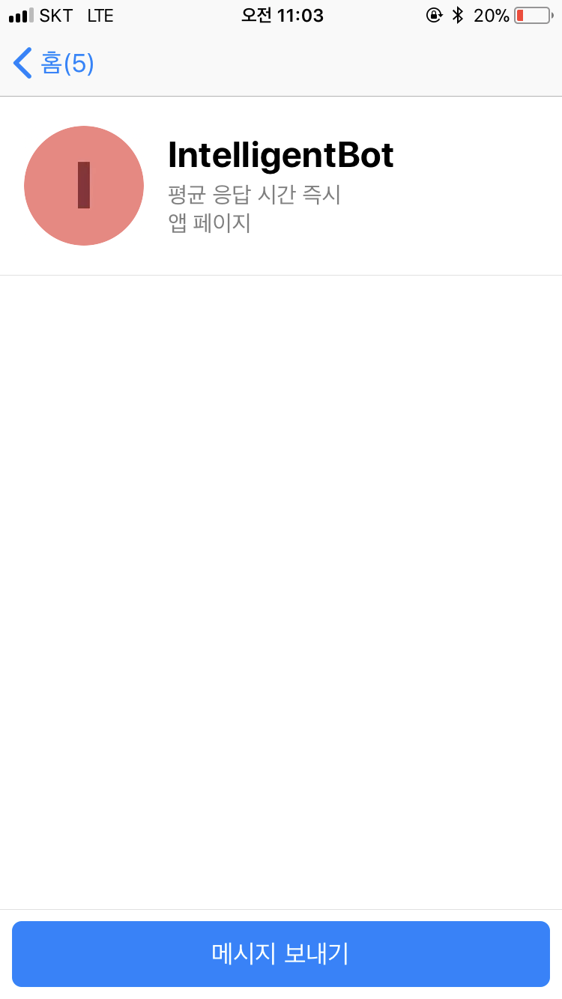
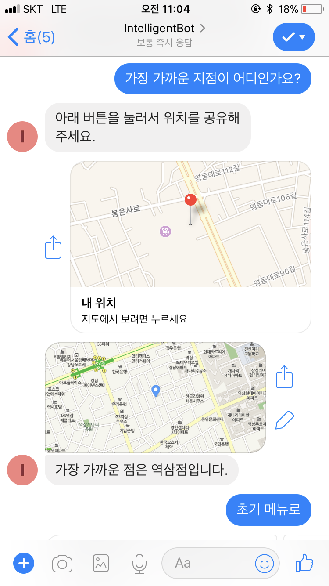

Lab601 - [채널 연결] Facebook 연결하기
=======

이 랩에서는 이때까지 만든 Bot을 Facebook과 연결해 보겠습니다. 

**Step 1: Facebook Page와 BOT 연결 시키기**
=======

### 1. Bot에 Facebook Channel을 등록 해 줍니다.

### 2. Facebook developer 계정을 생성해서, Bot의 정보를 등록 해 줍니다. 이로써 만들어진 봇을 Facebook을 통해 노출이 가능합니다.

**Step 2: Facebook으로 테스트 하기**
=======

### 1. 연결한 Page를 통해서 대화 해 보세요. 

{width=50%}

