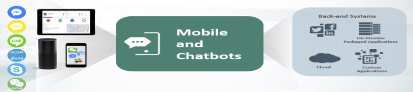

# Oracle Bot 실습하기

Oracle Cloud를 이용하여 인간의 언어(Natural Language)를 이해하는 나만의 첫번째 챗봇을 간단하게 만들어 보는 Hands on Workshop 입니다.
Training 과정을 통해 더욱 정교한 대화가 가능한 챗봇으로 진화시키는 과정을 체험하고, 비즈니스 처리를 위한 로직을 쉽게 작성하여 챗봇을 통해 서비스하게 하는 경험을 하시게 될 것입니다.

이 실습에서는 가상의 "금융 뱅킹 봇"을 개발 해 보고, 테스트 할 것입니다. 만드실 이 챗봇은 대화를 통해서 은행 계좌에서 잔액을 찾고, 은행 계좌간에 돈을 송금하고, 다른 사람과 계좌로 송금 할 수 있는 봇입니다. 

# Prerequisite 
이 핸즈온을 완료하려면 Oracle Autonomous Mobile Cloud, Enterprise (AMCe)에 액세스해야합니다. Oracle Cloud 계정을 이미 가지고 계시다면 Digital Assistant Cloud Service 인스턴스를 생성한 후 이 과정을 수행하시면 됩니다. 

Oracle Cloud 계정이 없다면 무료로 제공되는 Trial 계정을 신청하세요
* [Trial 계정 신청하기](http://www.oracloud.kr/post/oracle_cloud_trial_universal/)

본 과정에서는 Oracle Digital Assitant의 접속 정보가 제공될 것입니다. 제공되는 정보를 이용하여 Digital Assitant Cloud에 연결하세요.

# Chatbot-Workshop Lab 자료

* Lab 100 : [Chatbot Overview](Lab100%20-%20Chatbot%20Overview.md)
* Lab 200 : [Training Data를 사용해 Chatbot을 Train](Lab200%20-%20Training%20Data%EB%A5%BC%20%EC%82%AC%EC%9A%A9%ED%95%B4%20Chatbot%EC%9D%84%20Train.md)
* Lab 300 : [다양한 Layout 사용해서 답변 생성하기](Lab300%20-%20%EB%8B%A4%EC%96%91%ED%95%9C%20Layout%20%EC%82%AC%EC%9A%A9%ED%95%B4%EC%84%9C%20%EB%8B%B5%EB%B3%80%20%EC%83%9D%EC%84%B1%ED%95%98%EA%B8%B0.md)
* Lab 400 : [Custom Component를 이용해서 서비스 개발하기](Lab400%20-%20Custom%20Component%EB%A5%BC%20%EC%9D%B4%EC%9A%A9%ED%95%B4%EC%84%9C%20%EC%84%9C%EB%B9%84%EC%8A%A4%20%EA%B0%9C%EB%B0%9C%ED%95%98%EA%B8%B0.md)
* Lab 500 : [Instant App을 이용해서 서비스 확장하기](Lab500%20-%20Instant%20App%EC%9D%84%20%EC%9D%B4%EC%9A%A9%ED%95%B4%EC%84%9C%20%EC%84%9C%EB%B9%84%EC%8A%A4%20%ED%99%95%EC%9E%A5%ED%95%98%EA%B8%B0.md)
* Lab 601 : [채널 연결 Part 1. Facebook 연결하기](Lab601%20-%20%EC%B1%84%EB%84%90%20%EC%97%B0%EA%B2%B0%20Part%201.%20Facebook%20%EC%97%B0%EA%B2%B0%ED%95%98%EA%B8%B0.md)
* Lab 602 : [채널 연결 Part 2. Web Client 연결하기](Lab602%20-%20%EC%B1%84%EB%84%90%20%EC%97%B0%EA%B2%B0%20Part%202.%20Web%20Client%20%EC%97%B0%EA%B2%B0%ED%95%98%EA%B8%B0.md)
